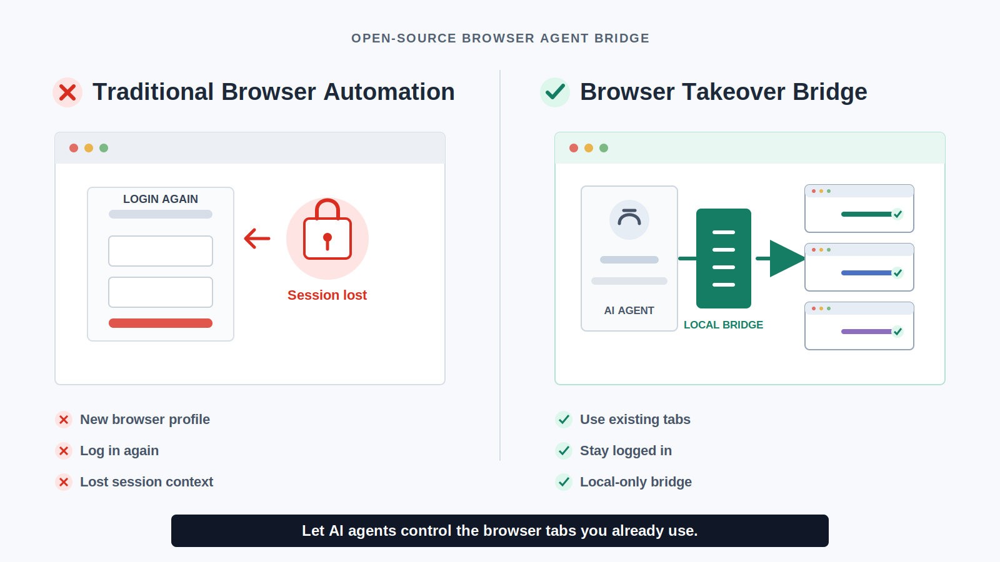

# Browser Takeover Bridge

Browser Takeover Bridge lets local AI agents work with browser tabs that are already open and already authenticated.



Most browser automation tools need a new browser profile or a browser that was started with a remote debugging port. This project adds a companion extension and localhost bridge so an agent can discover and control the user's normal Chrome or Edge tabs without asking the user to log in again.

## What It Can Do

- List already-open Chrome or Edge tabs from the user's normal browser profile.
- Read visible page text and DOM structure.
- Type prompts, click buttons, navigate tabs, and capture screenshots.
- Fetch image resources that require the browser's logged-in session.
- Fall back to Chrome DevTools Protocol for browsers launched with `--remote-debugging-port`.
- Claim tabs using renewable readonly or interactive leases.
- Use a structured action protocol for reliable click, fill, read, press, select, and snapshot operations.
- Authenticate extension traffic to the localhost bridge with a per-extension token.
- Display live connection health and errors in the extension popup.
- Stream tab lifecycle events and capture multiple open tabs in one readonly batch.
- Verify write actions using observable URL, text, element, or value evidence.

Verified locally with:

- ChatGPT: send prompts and download generated images.
- Feishu/Lark Docs: read document text and download embedded images.
- Toutiao: read authenticated pages and capture screenshots.

## Project Layout

```text
browser-takeover/
  .codex-plugin/plugin.json
  .mcp.json
  extension/
    manifest.json
    background.js
  scripts/
    browser_takeover_mcp.py
  skills/
    browser-takeover/SKILL.md
  README.md
```

## How It Works

1. The MCP server starts a local bridge on `127.0.0.1:17321`.
2. The browser extension polls that bridge from the user's normal browser profile.
3. The extension reports open tabs and executes requested commands in those tabs.
4. Results are returned to the local MCP server.

The bridge is local-only. It does not expose a public network service.

## Install The Extension

1. Open `edge://extensions` or `chrome://extensions`.
2. Enable developer mode.
3. Click "Load unpacked".
4. Select:

```text
browser-takeover/extension
```

## MCP Server

The plugin MCP entrypoint is:

```text
browser-takeover/scripts/browser_takeover_mcp.py
```

Useful tools include:

- `browser_takeover_extension_bridge_status`
- `browser_takeover_extension_list_tabs`
- `browser_takeover_extension_reload`
- `browser_takeover_extension_evaluate`
- `browser_takeover_extension_navigate`
- `browser_takeover_extension_screenshot`
- `browser_takeover_claim_tab`
- `browser_takeover_renew_claim`
- `browser_takeover_release_tab`
- `browser_takeover_extension_action`

## Security Model

- The extension must be installed by the user.
- The bridge listens only on `127.0.0.1`.
- Extension traffic is authenticated after registration and CORS is restricted to extension origins.
- The agent can only access tabs in the browser profile where the extension is installed.
- The project does not bypass authentication, permissions, CAPTCHAs, paywalls, or browser security boundaries.
- Treat every connected page as sensitive. Avoid logging private document contents, signed URLs, or account data.

## CDP Boundary

An ordinary Chrome or Edge window cannot be attached through CDP after launch unless it was started with a flag such as:

```powershell
msedge.exe --remote-debugging-port=9222
chrome.exe --remote-debugging-port=9222
```

The extension bridge exists to cover the practical case where the user already has the page open in their normal logged-in browser.

## Support

Browser Takeover Bridge is open source and built for people experimenting with Codex, browser agents, and authenticated web workflows.

If it helps you, optional support is welcome:

[Support on Afdian](https://afdian.com/a/fangsylar)

## License

MIT
