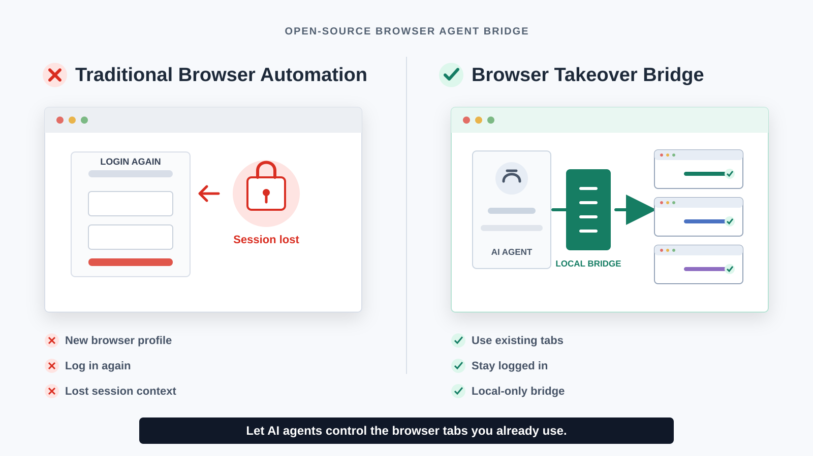

# Browser Takeover Bridge

> Public beta — the core browser-control path is tested and usable. Store distribution and
> third-party browser compatibility certification are still in progress.

[Product website](https://fangsylar-pixel.github.io/browser-takeover-bridge/) ·
[Download v0.6.0](https://github.com/fangsylar-pixel/browser-takeover-bridge/releases/tag/v0.6.0)

## Install In Codex

Add this repository as a Codex Marketplace source, then install the plugin:

```powershell
codex plugin marketplace add fangsylar-pixel/browser-takeover-bridge
codex plugin add browser-takeover@browser-takeover-marketplace
```

Restart Codex and open a new thread after installation. The companion Chrome or Edge extension
still needs to be loaded once from `browser-takeover/extension` or the release ZIP.


## Install In MARVIS

MARVIS can load the Browser Takeover skill files, but some versions do not automatically register
the bundled `browser-takeover/.mcp.json`. If the skill appears installed but no
`browser_takeover_*` tools are available, add the MCP server manually in MARVIS:

```json
{
  "mcpServers": {
    "browser-takeover": {
      "command": "python",
      "args": [
        "C:\\absolute\\path\\to\\browser-takeover\\scripts\\browser_takeover_mcp.py"
      ]
    }
  }
}
```

Use an absolute path because MARVIS may start MCP servers from a different working directory.
Restart MARVIS after saving the MCP configuration, then open a new conversation and confirm that
`browser_takeover_extension_bridge_status` is available.

The companion extension is still required:

1. Open `chrome://extensions` or `edge://extensions`.
2. Enable developer mode.
3. Choose **Load unpacked**.
4. Select the installed `browser-takeover/extension` directory.

### MARVIS Troubleshooting

- **Tools are missing:** the skill was copied, but the MCP server was not registered. Add the
  configuration above and restart MARVIS.
- **Port 17321 is listening, but MARVIS shows no tools:** a detached
  `browser_takeover_mcp.py` process is running outside MARVIS. Stop that process before
  restarting the registered MCP server to avoid a port conflict.
- **`clients: []` or `tabCount: 0`:** no extension client is connected. Check that
  the unpacked extension is loaded in the same Chrome or Edge profile that owns the target tabs.
- **Bridge status is healthy but tabs are unavailable:** open a normal web page in that browser
  profile and check the extension popup for paused automation, trusted-site restrictions, or
  connection errors.

A healthy installation has all three layers connected: MARVIS lists the MCP tools, the local bridge
answers on `127.0.0.1:17321`, and bridge diagnostics report at least one fresh extension client.

Browser Takeover is a local-first browser control layer that lets AI agents work with Chrome and
Edge tabs that are already open and already authenticated.

Unlike browser automation that forces users into a fresh profile, Browser Takeover works with the
session they already trust. It adds visible safety controls, trusted-site restrictions, diagnostic
health reporting, and an open local protocol for Codex and other MCP-compatible agents.



Most browser automation tools need a new browser profile or a browser that was started with a remote debugging port. This project adds a companion extension and localhost bridge so an agent can discover and control the user's normal Chrome or Edge tabs without asking the user to log in again.

## What It Can Do

- List already-open Chrome or Edge tabs from the user's normal browser profile.
- Read visible page text and DOM structure.
- Type prompts, click buttons, navigate tabs, and capture screenshots.
- Fetch image resources that require the browser's logged-in session.
- Fall back to Chrome DevTools Protocol for browsers launched with `--remote-debugging-port`.
- Claim tabs using renewable readonly or interactive leases.
- Use a structured action protocol for reliable click, fill, read, press, select, and snapshot operations.
- Authenticate extension traffic to the localhost bridge with a per-extension token.
- Display live connection health and errors in the extension popup.
- Stream tab lifecycle events and capture multiple open tabs in one readonly batch.
- Persist webpage monitors, compare readonly snapshots, and detect text or numeric conditions.
- Verify write actions using observable URL, text, element, or value evidence.
- Pause all automation instantly from the extension popup.
- Restrict control to an explicit trusted-site list.
- Copy privacy-safe diagnostics for support and team troubleshooting.
- Wait for SPA navigation to satisfy URL, selector, and text evidence before reporting success.
- Discover custom clickable controls and return reusable selectors in structured snapshots.
- Traverse DOM pagination with deduplication, partial-result recovery, and explicit stop reasons.

Verified locally with:

- ChatGPT: send prompts and download generated images.
- Feishu/Lark Docs: read document text and download embedded images.
- Toutiao: read authenticated pages and capture screenshots.

## Webpage Monitoring In MARVIS

Browser Takeover can now monitor content in an already-open Chrome or Edge tab. The MCP server
stores monitor definitions and snapshot history locally; MARVIS Automatic Tasks supplies the
schedule. Monitoring reuses the extension's readonly claim system and does not add browser
permissions.

### Quick start

After installing the plugin and confirming that `browser_takeover_extension_bridge_status` reports
a connected client:

1. Open the page you want to monitor in the connected browser profile.
2. Ask MARVIS to create a monitor. Prefer a stable CSS or semantic target instead of the entire
   page, because clocks, advertisements, and rotating recommendations can create noisy changes.
3. Run the monitor once to create its baseline.
4. Add a MARVIS Automatic Task that checks it at the desired interval.
5. Notify only when `newlyTriggered` is `true`, and include the returned diff and source URL.

Example prompts:

```text
监控当前商品页面的 .price 元素，价格低于 500 元时提醒我。先检查一次建立基线。

监控这个报名页面的正文；出现“立即报名”时提醒我，并附上变化内容和页面链接。

每天上午 9 点检查这个游戏公告页面，有变化时告诉我新增或删除了哪些内容。
```

### Trigger rules

| Rule | Purpose | Example |
| --- | --- | --- |
| `changed` | Any content change after the first baseline | Announcement or policy updates |
| `contains` | Text appears | `立即报名`, `有货` |
| `not_contains` | Text disappears | Maintenance banner removed |
| `equals` | Exact text match | Status becomes `已开放` |
| `regex` | Pattern match | Version numbers or structured status text |
| `number_above` | Extracted number exceeds a threshold | Score, capacity, or queue length |
| `number_below` | Extracted number falls below a threshold | Product price |

For prices or other mixed text, provide `numberPattern` with a capture group, for example
`¥([\\d,]+(?:\\.\\d+)?)`.

### Monitor tools

- `browser_takeover_monitor_create`: create a persistent monitor.
- `browser_takeover_monitor_check`: capture content, compare it with the last snapshot, evaluate the
  rule, and save history.
- `browser_takeover_monitor_list`: list active or paused monitors without returning stored page
  content.
- `browser_takeover_monitor_history`: inspect recent checks; content is excluded unless
  `includeContent` is explicitly enabled.
- `browser_takeover_monitor_update`: pause, resume, rename, or replace a trigger rule.
- `browser_takeover_monitor_delete`: permanently remove a monitor and its local history.

On Windows, monitor data defaults to `%LOCALAPPDATA%\\BrowserTakeover\\monitors.json`. On other
systems it defaults to `~/.browser-takeover/monitors.json`. Set
`BROWSER_TAKEOVER_MONITOR_FILE` to choose another location. History from authenticated pages may be
sensitive, so do not sync or share this file unintentionally.

The monitor module deliberately does not buy, submit, publish, or bypass CAPTCHA/login controls.
Those remain separate interactive actions and require explicit authorization.

## Project Layout

```text
browser-takeover/
  .codex-plugin/plugin.json
  .mcp.json
  extension/
    manifest.json
    background.js
  scripts/
    browser_takeover_mcp.py
    webpage_monitor.py
  skills/
    browser-takeover/SKILL.md
  README.md
website/
  src/
  public/
  package.json
```

## Download And Verify

GitHub releases contain:

- `browser-takeover-extension-<version>.zip` for loading the companion extension.
- `browser-takeover-plugin-<version>.zip` for Codex or MCP-compatible local installation.
- `SHA256SUMS.txt` for integrity verification.

Maintainers can reproduce these files locally with:

```powershell
python browser-takeover/scripts/verify_release.py
```

## Product Website

The bilingual product website lives in `website/`. It automatically selects Chinese or English
from the browser locale and includes a manual language switch.

Public website: <https://fangsylar-pixel.github.io/browser-takeover-bridge/>

```powershell
cd website
npm install
npm run dev
```

## How It Works

1. The MCP server starts a local bridge on `127.0.0.1:17321`.
2. The browser extension polls that bridge from the user's normal browser profile.
3. The extension reports open tabs and executes requested commands in those tabs.
4. Results are returned to the local MCP server.

The bridge is local-only. It does not expose a public network service.

## Install The Extension

1. Open `edge://extensions` or `chrome://extensions`.
2. Enable developer mode.
3. Click "Load unpacked".
4. Select:

```text
browser-takeover/extension
```

## MCP Server

The plugin MCP entrypoint is:

```text
browser-takeover/scripts/browser_takeover_mcp.py
```

Useful tools include:

- `browser_takeover_extension_bridge_status`
- `browser_takeover_extension_list_tabs`
- `browser_takeover_extension_reload`
- `browser_takeover_extension_evaluate`
- `browser_takeover_extension_navigate`
- `browser_takeover_extension_screenshot`
- `browser_takeover_claim_tab`
- `browser_takeover_renew_claim`
- `browser_takeover_release_tab`
- `browser_takeover_extension_action`
- `browser_takeover_monitor_create`
- `browser_takeover_monitor_check`
- `browser_takeover_monitor_list`
- `browser_takeover_monitor_history`
- `browser_takeover_monitor_update`
- `browser_takeover_monitor_delete`

## Security Model

- The extension must be installed by the user.
- The bridge listens only on `127.0.0.1`.
- Users can pause automation globally at any time.
- Users can restrict commands to trusted hostnames from the popup.
- Extension traffic is authenticated after registration and CORS is restricted to extension origins.
- The agent can only access tabs in the browser profile where the extension is installed.
- The project does not bypass authentication, permissions, CAPTCHAs, paywalls, or browser security boundaries.
- Treat every connected page as sensitive. Avoid logging private document contents, signed URLs, or account data.

Read the full [privacy policy](PRIVACY.md), [security policy](SECURITY.md), and
[terms of use](TERMS.md) before deploying the bridge in a team environment. For troubleshooting,
see the [support guide](SUPPORT.md).

## CDP Boundary

An ordinary Chrome or Edge window cannot be attached through CDP after launch unless it was started with a flag such as:

```powershell
msedge.exe --remote-debugging-port=9222
chrome.exe --remote-debugging-port=9222
```

The extension bridge exists to cover the practical case where the user already has the page open in their normal logged-in browser.

## Why Teams Choose Browser Takeover

- **Local-first:** the control bridge is bound to localhost.
- **Browser choice:** supports both Chrome and Edge.
- **Existing sessions:** works with tabs where the user is already signed in.
- **Operational safety:** pause switch, trusted-site mode, claims, leases, and evidence checks.
- **Built for hard pages:** Shadow DOM, iframes, uploads, downloads, native input, and full-page capture.
- **Open integration:** a documented MCP surface instead of a single-vendor workflow.

## Support

Browser Takeover Bridge is open source and built for people experimenting with Codex, browser agents, and authenticated web workflows.

If it helps you, optional support is welcome:

[Support on Afdian](https://afdian.com/a/fangsylar)

Bug reports and contributions are welcome. See [CONTRIBUTING.md](CONTRIBUTING.md).

## License

MIT

